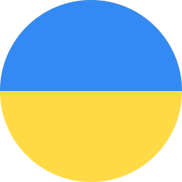

# Hey you, you're finally awake 🖖

You were trying to find an aspiring young developer? Walked right into my GitHub profile. Hi, I'm Michael Mykhaylov, Full-Stack developer and aspiring Data Scientist from  Ukraine currently living in  USA.

Computer Science Major at [Arizona State University](https://www.asu.edu). Tech enthusiast with a neverending love for books, reading, chess, cycling and coffee

## 💻 My web projects usually work on...

 
 

## and 🧪 data science projects on

## ⏳ Sometimes I also use ...

## ... 📚 and I would love to learn...

### 📬 Let's get to know each other

- StackOverflow: [Michael Mykhaylov](https://stackoverflow.com/users/12770693/michael-mykhaylov)
- GitHub: [mmykhaylov](https://github.com/mmykhaylov)
- LinkedIn: [Michael Mykhaylov](https://www.linkedin.com/in/mmykhaylov/)
- Website: coming soon...
- E-mail: [mikemikhailov2003@gmail.com](mailto:mikemikhailov2003@gmail.com)
